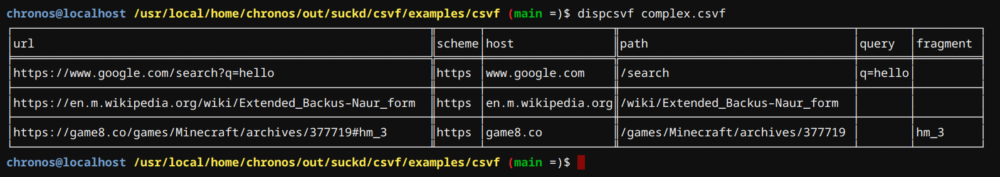

# csvf
CSVF is a file format similar to CSV that you can view in a terminal.

[view specification](https://github.com/matthew-james-brewer/csvf/blob/main/csvf-0.0.1.md)

## using the tools

Before you can use anything in the repository, you must clone in and switch to the created directory (`git clone https://github.com/matthew-james-brewer/csvf.git; cd csvf`).

### c

To use the C tools, you must go into the c directory (`cd c`) and run the install script (`bash makescript.sh`). It creates 4 files:
 * $SYSROOT/$LIBDIR/libcsvf.so
 * $SYSROOT/include/libcsvf.h
 * $SYSROOT/bin/csv2csvf
 * $SYSROOT/bin/dispcsvf

By default, $SYSROOT is `/usr`, and $LIBDIR is `lib`. You can change them to fit your system (ie. `export SYSROOT=/usr/local` and `export LIBDIR=lib64`).

After that, you can convert csv files to csvf files (`csv2csvf x.csv x.csvf`) and display csvf files (`dispcsvf x.csvf`). You can also create C programs that use libcsvf. See the *-cmd.c files for demonstration of use. Compile with `-lcsvf` and put `#include <libcsvf.h>` at the top of your file.

### java

To use the Java tools, you must go into the java directory (`cd java`) and run `javac DispTable.java`, which generates DispTable.class.

Then, you can display csvf files (`java DispTable x.csvf` in the same directory as DispTable.class).

### js

To use the Javascript tools, you must create something that uses them. Some examples are provided in the `examples` folder.
